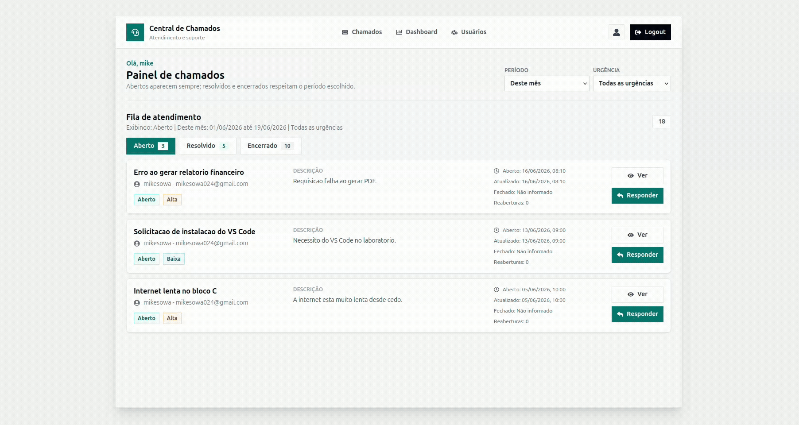
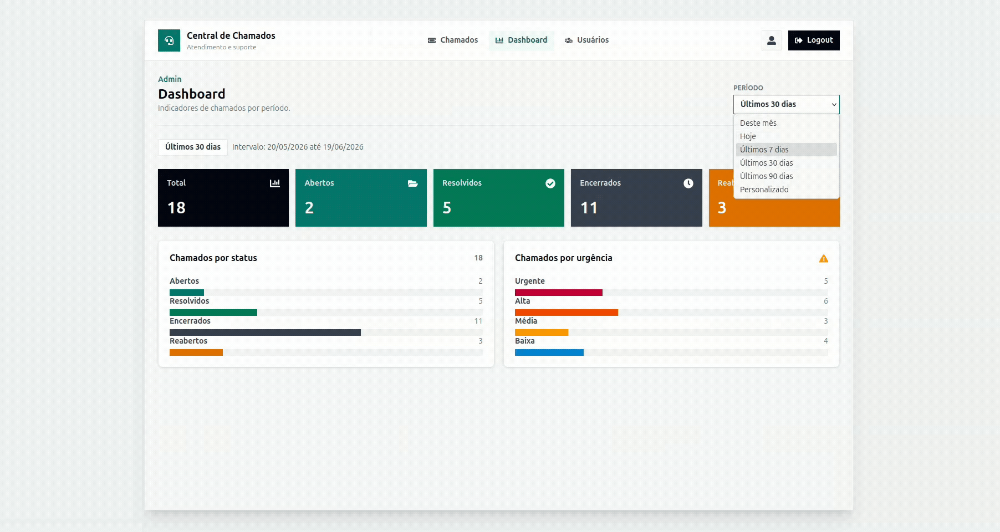
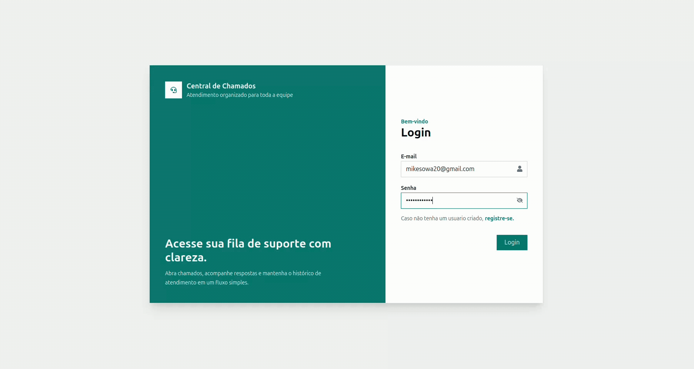
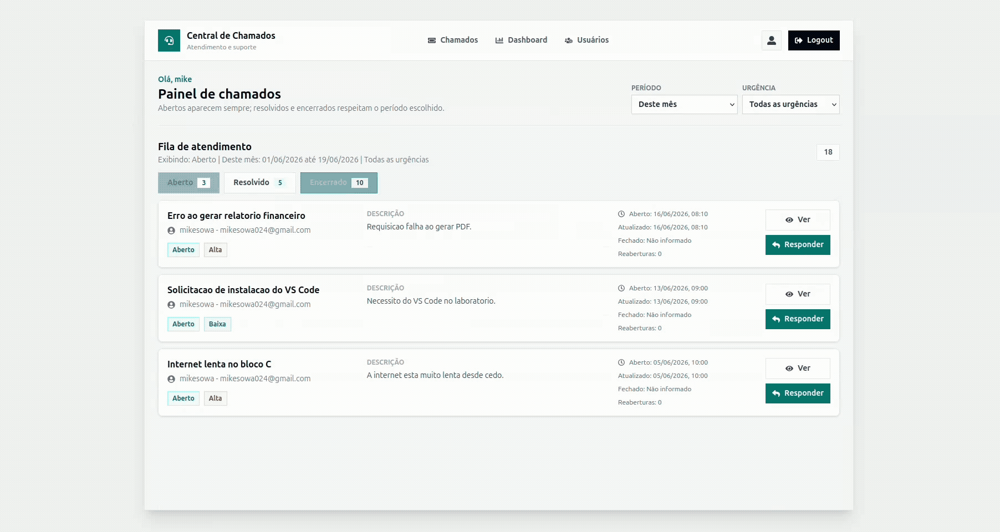

# 📋 Sistema de Chamados


Sistema web de gerenciamento de chamados desenvolvido para facilitar a comunicação entre usuários e administradores, permitindo a abertura, acompanhamento e resolução de solicitações de forma organizada.
<p align="center">
  
</p>

## ✨ Principais Recursos

- 🔐 Autenticação com JWT
- 👥 Controle de permissões (Usuário/Admin)
- 🎫 Sistema completo de chamados
- 🔄 Reabertura de chamados resolvidos
- 📊 Dashboard administrativo
- ⚡ API REST com Flask

## 🚀 Funcionalidades

### Usuário
- Criar chamados
- Visualizar chamados enviados
- Acompanhar status dos chamados
- Reabrir chamados resolvidos
- Adicionar respostas aos chamados
- Editar informações do perfil

### Administrador
- Visualizar todos os chamados
- Filtrar chamados por status e período
- Responder chamados
- Alterar status dos chamados
- Gerenciar usuários
- Acessar métricas e informações do sistema

<p align="center">
  
</p>

## 🛠️ Tecnologias Utilizadas

### Front-end
- React
- TypeScript
- React Router
- Axios
- React Icons

### Back-end
- Flask
- SQLAlchemy
- Flask-Bcrypt
- JWT Authentication

### Banco de Dados
- SQLite (desenvolvimento)
- Compatível com outros bancos suportados pelo SQLAlchemy

## 📂 Estrutura do Projeto

```
Sistema-Chamados/
│
├── frontend/
│   ├── src/
│   ├── public/
│   └── package.json
│
├── backend/
│   ├── routes/
│   ├── models/
│   ├── config/
│   ├── app.py
│   └── requirements.txt
│
└── README.md
```

## 🔐 Controle de Acesso
O sistema possui autenticação baseada em JWT e controle de permissões para:

- Usuários comuns
- Administradores

<p align="center">
  
</p>

As rotas administrativas são protegidas para impedir acesso não autorizado.


## 📊 Fluxo do Chamado

<p align="center">
  
</p>
```
Usuário cria chamado
          ↓
Administrador visualiza
          ↓
Administrador responde
          ↓
Status alterado para Resolvido
          ↓
Usuário pode:
    • Encerrar processo
    • Reabrir chamado
          ↓
Administrador responde novamente
```

## ⚙️ Instalação
```
git clone https://github.com/seu-usuario/sistema-chamados.git
```

### Backend
```
    cd backend

    python -m venv .venv

    source .venv/bin/activate
    # Linux

    pip install -r requirements.txt

    flask run
```

### Frontend
```
    cd frontend

    npm install

    npm run dev
```

### 🗄️ Variáveis de Ambiente
```
    SECRET_KEY=sua_chave_secreta
    DATABASE_URL=sqlite:///database.db
```